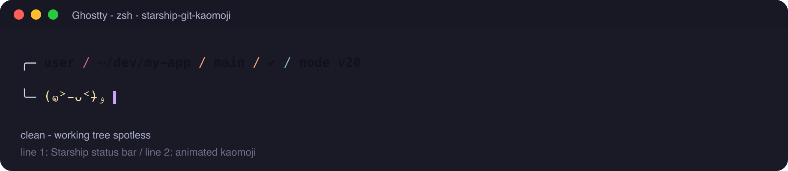
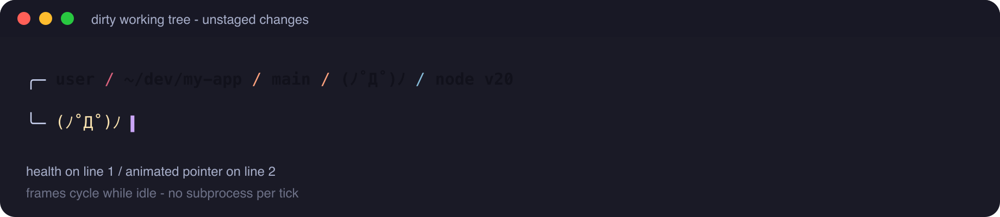
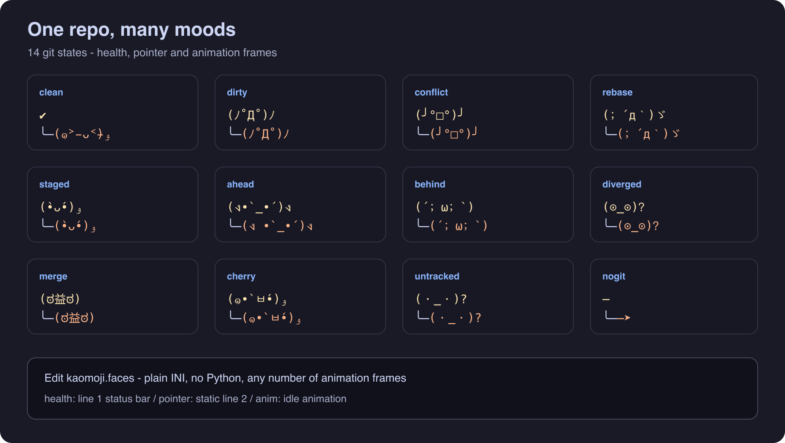
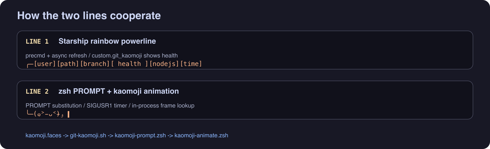

<div align="center">

# starship-git-kaomoji

**Animated git-status kaomoji for [Starship](https://starship.rs) + zsh**

Inspired by the beloved [jovial](https://github.com/zthxxx/jovial) theme — rainbow powerline on top, expressive kaomoji on the input line.

<br>

[](LICENSE)
[](https://www.zsh.org/)
[](https://starship.rs/)
[]()

<br>



*Line 1: Starship status bar &nbsp;·&nbsp; Line 2: animated kaomoji pointer*

</div>

---

## Why this exists

Most Starship setups put everything on **one line**. [jovial](https://github.com/zthxxx/jovial) showed how delightful a **two-line** shell can feel — a rich status bar above, a playful input line below.

**starship-git-kaomoji** brings that spirit to Starship:

| | jovial-style layout | Starship superpowers |
|---|---|---|
| **Line 1** | `╭─` rainbow powerline | modules, async, cross-language version hints |
| **Line 2** | `╰─` kaomoji pointer | git-aware faces that **animate while idle** |

No Python. No JSON. No Node. Just zsh + sh + a plain-text face file.

---

## Preview

<table>
<tr>
<td width="50%">

**Clean repo** — all is well


</td>
<td width="50%">

**Dirty repo** — something changed



</td>
</tr>
</table>

<details>
<summary><strong>All 14 git states at a glance</strong></summary>
<br>

<br><br>
<code>clean</code> · <code>dirty</code> · <code>staged</code> · <code>untracked</code> · <code>conflict</code> · <code>rebase</code> · <code>merge</code> · <code>ahead</code> · <code>behind</code> · <code>diverged</code> · <code>cherry</code> · <code>revert</code> · <code>bisect</code> · <code>nogit</code>
</details>

<br>



---

## Features

- **Two-line prompt** — Starship draws line 1 in `precmd`, zsh draws line 2 via `PROMPT`
- **14 git states** — clean, dirty, staged, conflict, rebase, ahead/behind, and more
- **Idle animation** — kaomoji cycles through frames while you think (configurable interval)
- **Three face roles per state** — `health` (status bar), `pointer` (static), `anim` (frames)
- **Fast** — faces compiled to cache; animation runs in-process (~0.08 ms/frame)
- **Zero extra runtimes** — `kaomoji.faces` is plain INI-like text parsed by POSIX `sh`
- **Terminal-friendly** — tested on Ghostty, iTerm2, Alacritty

---

## Requirements

| Tool | Version |
|------|---------|
| [Starship](https://starship.rs/guide/#%E1%83%A6-installation) | any recent |
| **zsh** | 5.8+ |
| **git** | optional (shows `─➤` outside repos) |

---

## Quick start

### 1. Clone

```bash
git clone https://github.com/YOUR_USER/starship-git-kaomoji.git \
  ~/.local/share/starship-git-kaomoji
```

### 2. Wire up zsh

Add to `~/.zshrc` **after** `eval "$(starship init zsh)"`:

```zsh
export STARSHIP_KAOMOJI_HOME="$HOME/.local/share/starship-git-kaomoji"
eval "$(starship init zsh)"
source "$STARSHIP_KAOMOJI_HOME/init.zsh"
```

> `init.zsh` auto-detects its own directory — `STARSHIP_KAOMOJI_HOME` is optional if you source by absolute path.

### 3. Configure Starship

Merge [`examples/starship.snippet.toml`](examples/starship.snippet.toml) into `~/.config/starship.toml`.

Key points:

1. Start `format` with `╭─` (line 1 corner)
2. **Do not** put `$character` / the input line in `format` — zsh owns line 2
3. Add `custom.git_kaomoji` for the health indicator in the status bar
4. Disable `[git_status]` — this library replaces it

Minimal snippet:

```toml
[character]
success_symbol = ""
error_symbol = ""
format = "$symbol"

[git_status]
disabled = true

[custom.git_kaomoji]
when = "git rev-parse --is-inside-work-tree >/dev/null 2>&1"
style = "bg:#FCA17D fg:black bold"
format = '[$output]($style)'
command = "$STARSHIP_KAOMOJI_HOME/git-kaomoji.sh health"
```

Reload:

```zsh
source ~/.zshrc
```

---

## Customise faces

Edit **`kaomoji.faces`** — one block per git state:

```ini
[conflict]
health= (╯°□°)╯
pointer=(╯°□°)╯ 
anim=(╯°□°)╯ |┻━┻ (╯°□°)╯|(ノ°ο°)ノ|flip the table again
```

| Key | Shows on | When |
|-----|----------|------|
| `health` | Line 1 status bar | Always (via Starship module) |
| `pointer` | Line 2 | Animation off |
| `anim` | Line 2 | Idle animation — frames separated by `\|`, any count |

Frame selection: `index % frame_count`.

Point to a custom file:

```zsh
export STARSHIP_KAOMOJI_FRAMES="$HOME/.config/kaomoji/my.faces"
```

On first load, faces compile to `~/.cache/starship-kaomoji/faces-*.sh` and refresh automatically when the source file changes.

---

## Configuration

| Variable | Default | Description |
|----------|---------|-------------|
| `STARSHIP_KAOMOJI_HOME` | install directory | Library root |
| `STARSHIP_KAOMOJI_INTERVAL` | `1` | Animation interval (seconds) |
| `STARSHIP_KAOMOJI_CORNER_BOT` | `╰─` | Line 2 left corner |
| `STARSHIP_KAOMOJI_FRAMES` | `$HOME/kaomoji.faces` | Custom face data file |
| `STARSHIP_KAOMOJI_FRAME_FILE` | `~/.cache/starship-kaomoji-frame` | Persisted frame counter |

```zsh
# Slower, calmer animation
export STARSHIP_KAOMOJI_INTERVAL=2.5
```

---

## How it works

```
┌─────────────────────────────────────────────────────────┐
│  precmd                                                   │
│    ├─ starship prompt  →  line 1 (async after commands)  │
│    └─ PROMPT hook      →  line 2 (kaomoji + cursor)      │
├─────────────────────────────────────────────────────────┤
│  idle timer (background)                                  │
│    SIGUSR1 → frame++ → zle reset-prompt                  │
└─────────────────────────────────────────────────────────┘
```

| File | Role |
|------|------|
| [`init.zsh`](init.zsh) | Entry point |
| [`kaomoji-prompt.zsh`](kaomoji-prompt.zsh) | Two-line prompt, precmd, async line-1 refresh |
| [`kaomoji-animate.zsh`](kaomoji-animate.zsh) | Idle animation timer |
| [`kaomoji-faces.zsh`](kaomoji-faces.zsh) | Zsh face loader (in-process, per-frame) |
| [`kaomoji-frames.sh`](kaomoji-frames.sh) | Sh face loader + cache for Starship |
| [`git-kaomoji.sh`](git-kaomoji.sh) | Git state detection |
| [`kaomoji.faces`](kaomoji.faces) | **Your face data** |

---

## Benchmark

```bash
./kaomoji-benchmark.sh [repo_dir] [iterations]
```

---

## Replacing preview images

Preview images are **PNG** files in `docs/assets/` (generated from the `.svg` sources). GitHub renders PNG reliably; SVG previews often break due to sanitization and font issues.

To regenerate after editing the SVG sources:

```bash
brew install librsvg   # once
cd docs/assets
for f in demo-*.svg; do rsvg-convert -w 1840 "$f" -o "${f%.svg}.png"; done
```

To use real terminal screenshots instead, save as `demo-clean.png` / `demo-dirty.png` and update paths in this README.

---

## Credits

- Face concept and layout inspired by **[jovial](https://github.com/zthxxx/jovial)** by [@zthxxx](https://github.com/zthxxx)
- Built on **[Starship](https://starship.rs)**

## License

[MIT](LICENSE) — use freely, customise faces, share your kaomoji.
